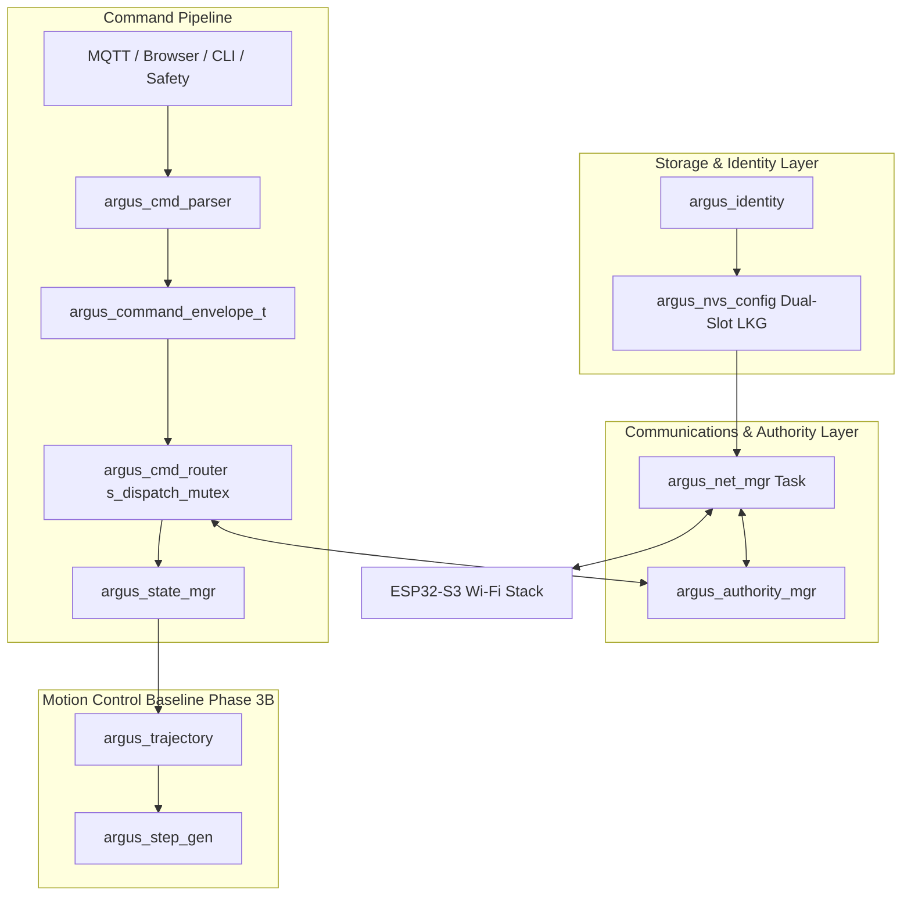
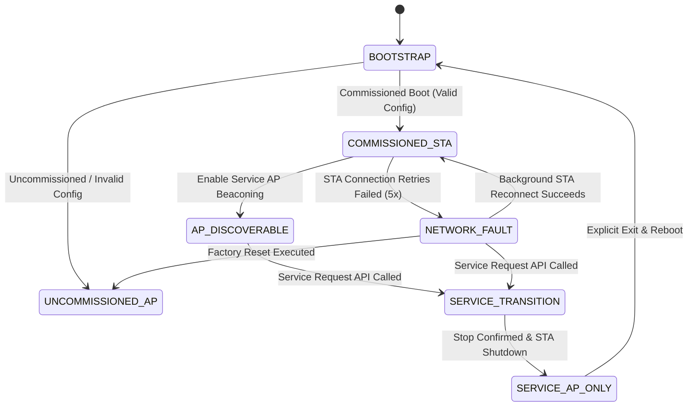

# Phase 4A Implementation Plan — Device Identity, Persistent Configuration, Network Modes, and Control Authority (Final Approved)

> [!NOTE]
> **Historical planning document.** Written before the Phase 4A hardening
> audit. Some claims (E-stop mutex bypass, test counts, authority-bypass
> APIs) were corrected during hardening. See `PHASE_4A_RUNTIME_ACCEPTANCE.md`
> for the authoritative verified evidence.
## Overview & Current Repository Baseline Audit

Phase 4A establishes persistent device identity, power-loss-safe dual-slot NVS storage, a multi-mode network manager, a normalized command router, and exclusive control authority for the `ArgusControl_PumpController-V2` firmware (at verified baseline commit `3d03d80`).

### Current Repository Baseline Audit
*   **Wi-Fi Initialization**: Currently embedded directly in `app_main.c` (`wifi_start_access_point_and_station()`). Phase 4A modularizes Wi-Fi lifecycle into `argus_net_mgr`.
*   **MQTT Broker Architecture**: Controller hosts an embedded local MQTT broker (`argus_mqtt_broker.c`) on port 1883. No external broker host/username/password fields are required.
*   **Command Paths**: Currently, `app_main.c` handles MQTT topic callbacks and calls `argus_state_mgr_*` directly. Phase 4A routes all incoming MQTT, CLI, and portal messages through a normalized command pipeline (`argus_cmd_router`).
*   **Motion Controller Baseline**: The Phase 3B motor control engine (1/4 microstepping, 8,000 steps/rev, 15 µs active-low STEP pulse, active-low ENABLE, inverted DIR mapping, 20 ms trajectory engine, 10.0 RPM/s acceleration, Bresenham GPTimer scheduler, and `argus_state_core_t` transition rules) remains untouched and authoritative over output motion.

---

## User Review Required & Design Decoupling

> [!IMPORTANT]
> **1. Service Credential Source of Truth**: The shared Argus service-AP credential (`CONFIG_ARGUS_SERVICE_AP_PASS`) is privately injected at build time via an untracked local `sdkconfig` file. It is compiled into firmware text memory and **NOT** copied to mutable NVS or `argus_cfg` slots. Builds fail closed if the credential is missing or shorter than 8 WPA2 characters. It never falls back to an open AP.
> 
> **2. Single NVS Namespace for Atomic STA Credentials**: `sta_ssid` and `sta_pass` are stored together inside the same `argus_cfg` dual-slot payload. Separate mutable `"argus_sec"` namespace is removed to ensure atomic payload commits and LKG rollbacks. Dual-slot record is unencrypted at rest unless NVS Encryption is enabled. Passwords are write-only, masked in telemetry/logs (`"********"`), and never returned in web GET responses.
> 
> **3. Schema Version 1 WPA2 Requirement**: Schema version 1 requires non-empty `sta_ssid` (1..32 bytes) AND non-empty `sta_pass` (8..63 chars). Open STA networks are **REJECTED** in schema version 1.
> 
> **4. One Pump, One Command Authority & Authority Owner**: Control authority (`ARGUS_AUTHORITY_*`) is separate from machine motion state (`ARGUS_STATE_*`). `LOCAL_SERVICE` authority tracks an explicit owner (`ARGUS_AUTH_OWNER_BROWSER` vs `ARGUS_AUTH_OWNER_DIAGNOSTIC_CLI`). Motion commands from non-owners are strictly rejected.
> 
> **5. Diagnostic CLI Authority Policy**: CLI motion commands do **NOT** coexist with supervisory MQTT or browser authority. CLI motion commands are disabled in production builds (`CONFIG_ARGUS_DIAGNOSTIC_MODE=n`) and require entering Hardware Acceptance Mode (`H`), which claims `ARGUS_AUTH_OWNER_DIAGNOSTIC_CLI` using the exact same service transition sequence.

---

## Architecture & Normalized Command Pipeline



---

## Component Specifications

### 1. Device Identity Module (`argus_identity`)
##### [NEW] [argus_identity.h](file:///c:/Users/bount/Dev/Argus/ArgusControl_PumpController-V2/main/argus_identity.h) / [argus_identity.c](file:///c:/Users/bount/Dev/Argus/ArgusControl_PumpController-V2/main/argus_identity.c)

*   **Immutable Hardware UID**: Derived at runtime from `esp_efuse_mac_get_default()` (`ESP32S3-XXYYZZAABBCC`). Not stored in editable NVS.
*   **Application Metadata**: Firmware version derived from `esp_app_get_description()->version`. Product model compiled constant `"ARGUS-PUMP-V2"`.
*   **Explicit Array Capacities**:
    - `client_id[33]`: Permitted ASCII [1..32] + null.
    - `unit_id[33]`: Permitted ASCII [1..32] + null.
    - `device_name[65]`: Printable ASCII [1..64] + null.
*   **Service AP SSID**: Concatenates `Argus-Service-` + last 6 hex digits of MAC UID (`Argus-Service-AABBCC`).

---

### 2. Exact Configuration Schema Table & Derived Commissioned State

| Field Name | Storage Type | Array Buffer | Max String Len | Default Value | Validation Rule | Secret? | Reset Behavior |
| :--- | :--- | :--- | :--- | :--- | :--- | :--- | :--- |
| **`schema_version`** | `uint16_t` | 2 B | N/A | `1` | Must equal `1` | No | Preserved (`1`) |
| **`config_generation`**| `uint32_t` | 4 B | N/A | `1` | Incremented on commit | No | Reset to `1` |
| **`client_id`** | `char[]` | 33 B | 32 chars | `"default_client"` | Alphanumeric, `-`, `_` [1..32] | No | Reset to default |
| **`unit_id`** | `char[]` | 33 B | 32 chars | `"unit_01"` | Alphanumeric, `-`, `_` [1..32] | No | Reset to default |
| **`device_name`** | `char[]` | 65 B | 64 chars | `"Argus Pump V2"` | Printable ASCII [1..64] | No | Reset to default |
| **`sta_ssid`** | `char[]` | 33 B | 32 bytes | `""` | Printable ASCII [1..32] | No | Cleared (`""`) |
| **`sta_pass`** | `char[]` | 64 B | 63 chars | `""` | WPA2 Passphrase [8..63] | **YES** | Cleared (`""`) |

> [!IMPORTANT]
> **Derived Commissioned State**: `is_commissioned` is evaluated dynamically:
> ```c
> bool is_commissioned = (slot.schema_version == ARGUS_CONFIG_SCHEMA_VERSION) &&
>                         (slot.valid_marker == 0xA5A55A5A) &&
>                         (strlen(slot.client_id) > 0) &&
>                         (strlen(slot.unit_id) > 0) &&
>                         (strlen(slot.sta_ssid) > 0) &&
>                         (strlen(slot.sta_pass) >= 8 && strlen(slot.sta_pass) <= 63);
> ```
> **No Stored RUN Intent**: `target_rpm_milli` is **NOT** persisted. Reboot always starts with 0 setpoint, 0 applied RPM, and motor driver `UNLOCKED`.

---

### 3. Concrete Dual-Slot Boot-Selection & Write Algorithm
##### [NEW] [argus_nvs_config.h](file:///c:/Users/bount/Dev/Argus/ArgusControl_PumpController-V2/main/argus_nvs_config.h) / [argus_nvs_config.c](file:///c:/Users/bount/Dev/Argus/ArgusControl_PumpController-V2/main/argus_nvs_config.c)

NVS layout uses dual slots (`slot_a`, `slot_b`) in `"argus_cfg"` and an active selector `active_slot`:

```c
typedef struct {
    uint16_t schema_version;
    uint32_t config_generation;
    uint16_t payload_length;
    uint32_t crc32;
    uint32_t valid_marker; // 0xA5A55A5A
    argus_config_payload_t payload;
} argus_cfg_slot_t;
```

#### Bootloader Dual-Slot Selection Matrix

| Slot A | Slot B | Active Selector | Selection Result |
| :--- | :--- | :--- | :--- |
| **Valid** | **Invalid** | A / B / Corrupt | Use **Slot A** |
| **Invalid** | **Valid** | A / B / Corrupt | Use **Slot B** |
| **Valid** | **Valid** | Points to A (0) | Use **Slot A** |
| **Valid** | **Valid** | Points to B (1) | Use **Slot B** |
| **Valid** | **Valid** | Corrupt / Invalid | Compare generations: use slot with higher `config_generation` |
| **Invalid** | **Invalid** | Any | Enter **Uncommissioned AP Recovery Mode** |
| **Older Valid** | **Newer prepared (no marker)** | Points to Older | Preserve **Older LKG Slot** |

*Generation wrap comparison uses serial number arithmetic `(int32_t)(genA - genB) > 0`. Generation 0 is reserved/invalid.*

---

### 4. Coherent Authority Snapshot & Router Serialization (`s_dispatch_mutex`)
##### [NEW] [argus_cmd_router.h](file:///c:/Users/bount/Dev/Argus/ArgusControl_PumpController-V2/main/argus_cmd_router.h) / [argus_cmd_router.c](file:///c:/Users/bount/Dev/Argus/ArgusControl_PumpController-V2/main/argus_cmd_router.c)

#### Lock Serialization Sequence
1. **Normal Command Dispatch**:
   - Acquire `s_dispatch_mutex`.
   - Call `argus_authority_mgr_get_snapshot()` (briefly acquires `s_auth_mutex`, copies coherent snapshot, releases `s_auth_mutex`).
   - Validate mode, owner, source, command type, and `env->authority_generation`.
   - Dispatch envelope to `argus_state_mgr_*` while holding `s_dispatch_mutex`.
   - Release `s_dispatch_mutex`.
2. **Authority Transition**:
   - Acquire `s_dispatch_mutex` (waits for in-flight normal commands to complete).
   - Acquire `s_auth_mutex`, update mode to `SERVICE_TRANSITION`, increment `authority_generation++`, release `s_auth_mutex`.
   - Release `s_dispatch_mutex`.
   - Perform controlled stop (`argus_state_mgr_stop_normal()`) and network transitions without holding locks.
3. **Internal E-Stop**: Bypasses `s_dispatch_mutex` and `s_auth_mutex` for microsecond preemption.

---

### 5. Control-Authority Manager & Owner Permission Matrix
##### [NEW] [argus_authority_mgr.h](file:///c:/Users/bount/Dev/Argus/ArgusControl_PumpController-V2/main/argus_authority_mgr.h) / [argus_authority_mgr.c](file:///c:/Users/bount/Dev/Argus/ArgusControl_PumpController-V2/main/argus_authority_mgr.c)

```c
typedef enum {
    ARGUS_AUTH_OWNER_NONE = 0,
    ARGUS_AUTH_OWNER_MQTT,
    ARGUS_AUTH_OWNER_BROWSER,
    ARGUS_AUTH_OWNER_DIAGNOSTIC_CLI
} argus_authority_owner_t;
```

| Authority Mode | Active Owner | MQTT Motion | Browser Portal Motion | CLI Motion (`H`) | Internal Safety (E-Stop) |
| :--- | :--- | :--- | :--- | :--- | :--- |
| **`NONE`** | `NONE` | REJECT | REJECT | REJECT | **ALLOW** |
| **`SUPERVISORY`** | `MQTT` | **ALLOW** | REJECT | REJECT | **ALLOW** |
| **`SERVICE_TRANSITION`** | `NONE` | REJECT | REJECT | REJECT | **ALLOW** |
| **`LOCAL_SERVICE`** | `BROWSER` | REJECT | **ALLOW** | REJECT | **ALLOW** |
| **`LOCAL_SERVICE`** | `DIAGNOSTIC_CLI` | REJECT | REJECT | **ALLOW** | **ALLOW** |

---

### 6. Network-Mode Manager & Network-Fault Recovery



#### Network-Fault Recovery Behavior
*   Commissioned boot with unreachable STA enters `NETWORK_FAULT`.
*   Motor remains stopped on boot.
*   Does **not** grant supervisory authority. Service AP becomes available at `192.168.4.1`.
*   Continues background STA reconnection attempts with bounded backoff.
*   Credentials remain intact (never erased). Grants supervisory authority only when STA and embedded MQTT broker are ready.

#### Wi-Fi Power-Save & Jitter Threshold Policy
*   `WIFI_PS_NONE` avoids Wi-Fi power-save latency and is expected to reduce scheduling disturbances. GPTimer behavior under concurrent AP+STA traffic requires physical measurement.
*   Provisional target: maximum STEP-edge jitter $\le 1 \text{ }\mu\text{s}$ under concurrent load, with zero malformed pulses or watchdog resets.

---

### 7. Corrected Safe Service-Exit & Factory Reset Protocol

#### Service Exit Sequence
1. Enter `SERVICE_TRANSITION`, increment `authority_generation++`, revoke local motion commands.
2. Request `argus_state_mgr_stop_normal()`. Poll snapshot until confirmed `HOLDING`/`UNLOCKED`.
3. If latched E-stop or fault exists, **abort exit** and require explicit technician reset.
4. Validate staged configuration fields in RAM. Write inactive NVS slot, commit, read back verify, write active selector `active_slot`, commit.
5. Call `esp_restart()`. Reboot initializes in `BOOTSTRAP` with 0 setpoint, motor `UNLOCKED`.

#### Power-Loss Recoverable Factory Reset
1. Check motor state. Requiring motor `HOLDING`/`UNLOCKED` or technician reset. If stop fails, abort reset.
2. Write and commit `factory_reset_pending = true` in `"argus_sys"` NVS namespace.
3. Invalidate dual-slot markers in `"argus_cfg"`. Call `esp_restart()`.
4. On boot, `argus_nvs_config_init()` observes `factory_reset_pending == true`. Completes erasure, clears marker, and boots into `UNCOMMISSIONED_AP` mode (`192.168.4.1`) using unchanged build-provisioned service credential.

---

### 8. Task, Queue, Locks, and 16-Error Model

#### FreeRTOS Task Specifications
*   `argus_net_mgr_task`: Priority 4, Stack 4096 B. Queue depth 10 (`argus_net_event_t`). Dropped status events increment error count; service entry/exit events fail closed on queue full. E-stop never uses queues.
*   `argus_cmd_router_task`: Priority 5, Stack 4096 B. Processes `argus_command_envelope_t` queue (depth 10).

#### Complete Lock Hierarchy (7 Locks)
1. `s_net_mutex` (Network mode synchronization)
2. `s_dispatch_mutex` (Command pipeline serialization)
3. `s_auth_mutex` (Control authority & owner synchronization)
4. `s_command_mutex` (State manager command lock)
5. `s_traj_mutex` (Trajectory linear ramp lock)
6. `s_lifecycle_mutex` (Step generator lifecycle lock)
7. `s_timing_mux` (ISR spinlock)

---

## Complete Planned Verification Matrices

### Planned Automated Pure Unit Test Matrix (42 Planned Tests)
##### [NEW] [main/argus_tests_4a.h](file:///c:/Users/bount/Dev/Argus/ArgusControl_PumpController-V2/main/argus_tests_4a.h) / [main/argus_tests_4a.c](file:///c:/Users/bount/Dev/Argus/ArgusControl_PumpController-V2/main/argus_tests_4a.c)

Will execute using stack-local instances and mock backends (0 Wi-Fi, 0 NVS, 0 GPIO, 0 tasks):

1.  `test_identity_mac_uid_derivation()`
2.  `test_identity_field_sanitization()`
3.  `test_nvs_schema_validation()`
4.  `test_nvs_open_sta_rejection()`
5.  `test_nvs_dual_slot_atomic_write_readback()`
6.  `test_nvs_lkg_rollback_on_crc_mismatch()`
7.  `test_nvs_corrupt_active_slot_fallback()`
8.  `test_nvs_both_slots_invalid_uncommissioned()`
9.  `test_nvs_partial_write_recovery()`
10. `test_nvs_unsupported_schema_version()`
11. `test_nvs_generation_wrap_comparison()`
12. `test_password_masking_in_telemetry()`
13. `test_mask_string_write_rejection()`
14. `test_missing_build_service_credential_fails_closed()`
15. `test_invalid_build_service_credential_fails_closed()`
16. `test_uncommissioned_boot_flow()`
17. `test_commissioned_boot_flow()`
18. `test_boot_sta_failure_retains_lkg_recovery_mode()`
19. `test_sta_connect_timeout_bounded_retry()`
20. `test_incidental_sta_loss_preserves_trajectory()`
21. `test_sta_reconnect_stale_command_invalidation()`
22. `test_ap_association_without_authority_transfer()`
23. `test_explicit_service_entry_sequence()`
24. `test_mqtt_rejection_during_service_transition()`
25. `test_local_command_rejection_before_transition_complete()`
26. `test_authority_generation_invalidation()`
27. `test_authority_snapshot_coherence()`
28. `test_browser_cli_owner_conflict_rejection()`
29. `test_dispatch_vs_transition_race_preemption()`
30. `test_router_queue_overflow_handling()`
31. `test_service_entry_stop_timeout_estop_trigger()`
32. `test_service_entry_estop_preserves_latch()`
33. `test_service_entry_faulted_machine_preserves_fault()`
34. `test_explicit_service_exit_sequence()`
35. `test_service_exit_invalid_config_preserves_lkg()`
36. `test_service_exit_commit_failure_preserves_ap_mode()`
37. `test_factory_reset_clears_credentials()`
38. `test_factory_reset_preserves_mac_uid()`
39. `test_factory_reset_rejected_while_estop_unresolved()`
40. `test_factory_reset_interruption_recovery()`
41. `test_cli_motion_rejected_in_supervisory_mode()`
42. `test_repeated_test_execution_singleton_non_mutation()`

---

### On-Device Hardware Acceptance Scenarios (28 Interactive Steps)

#### Scenario A — Uncommissioned Device Flow
1. Empty NVS boot triggers AP mode `Argus-Service-XXXX` at `192.168.4.1`.
2. AP SSID matches MAC UID suffix (`Argus-Service-AABBCC`).
3. DHCP assigns `192.168.4.2` to connected client. Max client limit (1) enforced.
4. Missing/invalid build service credential fails closed (AP does not start).
5. Valid build service credential accepted.
6. AP client association leaves motor `UNLOCKED`, authority `NONE`.
7. Stage valid STA configuration via Phase 4A diagnostic seam and execute reboot.

#### Scenario B — Commissioned Supervisory Flow
8. Commissioned STA connects successfully.
9. Authority becomes `SUPERVISORY` (owner `MQTT`).
10. Service AP becomes discoverable in AP+STA mode.
11. AP client association alone leaves authority `SUPERVISORY` (motor keeps running).
12. MQTT supervisory motion commands accepted.
13. Incidental STA disconnect while running 50 RPM maintains 50 RPM trajectory.
14. STA reconnection re-establishes MQTT without dropping motion.
15. Stale pre-disconnect MQTT commands rejected.

#### Scenario C — Active-Motion Service Entry Flow
16. MQTT starts known motion trajectory at 100 RPM.
17. Explicit service request (`argus_authority_request_service()`) revokes MQTT authority immediately.
18. Motor executes controlled normal deceleration to 0 RPM (`HOLDING`).
19. STA network interface shuts down cleanly.
20. Local authority granted (`ARGUS_AUTH_OWNER_DIAGNOSTIC_CLI`).
21. Explicit service exit commits valid credentials and reboots.
22. Reboot initializes with zero setpoint, motor `UNLOCKED`.

#### Scenario D — Failure & Reset Flow
23. STA boot failure retains LKG and enters `NETWORK_FAULT` recovery AP mode (`192.168.4.1`).
24. Service entry stop timeout triggers software E-stop and inhibits local motion.
25. Measure STEP pulse jitter under concurrent AP+STA Wi-Fi load at 200 RPM (26.67 kHz STEP rate); verify jitter remains below 1 µs threshold with 0 watchdog resets.
26. Factory reset `F` writes pending marker, erases mutable credentials, and reboots.
27. Reboot clears pending marker and initializes uncommissioned AP mode.
28. Repeated service entry/exit cycles produce zero memory leaks or stuck tasks.

---

## File Touch List & Scope Boundaries

### New Files to Create (12)
1. `main/argus_identity.h`
2. `main/argus_identity.c`
3. `main/argus_nvs_config.h`
4. `main/argus_nvs_config.c`
5. `main/argus_net_mgr.h`
6. `main/argus_net_mgr.c`
7. `main/argus_authority_mgr.h`
8. `main/argus_authority_mgr.c`
9. `main/argus_cmd_router.h`
10. `main/argus_cmd_router.c`
11. `main/argus_tests_4a.h`
12. `main/argus_tests_4a.c`

### Existing Files to Modify (8)
1. `main/app_main.c`
2. `main/CMakeLists.txt`
3. `main/Kconfig.projbuild`
4. `main/argus_cmd_parser.h` / `main/argus_cmd_parser.c`
5. `main/argus_mqtt_broker.h` / `main/argus_mqtt_broker.c`
6. `main/argus_tests.h` / `main/argus_tests.c`
7. `docs/V2_BASELINE_AUDIT.md`
8. `docs/V2_CONTROLLER_ARCHITECTURE.md`
