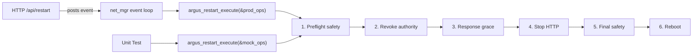

# Phase 4B.2 Final Source-Correction Pass — Walkthrough

**Commit:** `13e7d56` on `phase4b-config-portal`
**Binary:** 944,505 bytes — 10% headroom on 1 MB app partition
**Build:** Compiled successfully, zero errors, zero warnings

---

## Summary of Changes

Six correction items from the independent review, executed as a single coherent pass:

| Item | Requirement | Resolution |
|------|-------------|------------|
| 1 | Pure test isolation — remove live production calls | Tests 35-37 replaced with injectable seam tests |
| 2 | Restart transaction seam | `argus_restart_mgr.h/.c` with injectable ops |
| 3 | Monotonic identity provisioning | NVS high-water marker prevents LKG rollback reopening |
| 4 | Configuration overlay seam | `argus_config_overlay.h/.c` — pure function |
| 5 | Documentation | DHR-012 (partition), DHR-013 (identity) |
| 6 | Build + static audit | Compiled, whitespace clean, credential scan clean |

---

## Item 2: Restart Transaction Seam

### New Files
- [argus_restart_mgr.h](../main/argus_restart_mgr.h) — Injectable ops struct, result struct, step enums
- [argus_restart_mgr.c](../main/argus_restart_mgr.c) — 6-step orchestration + production ops

### Architecture

The production `argus_net_mgr.c` restart handler is now 10 lines — it creates ops and calls the shared transaction function. Tests inject mock ops that record the exact call sequence.

### Wiring
- [argus_net_mgr.c](../main/argus_net_mgr.c#L180-L197): `ARGUS_NET_EVT_RESTART_REQUEST` now calls `argus_restart_execute()`

---

## Item 3: Monotonic Identity Provisioning

### Problem
If the active slot (gen=2, PROVISIONED) is corrupted and LKG (gen=1, not provisioned) is selected, the portal identity page would reopen — allowing an attacker to re-provision identity.

### Solution — Three-Layer Defense

1. **Slot OR:** `argus_nvs_core_init()` ORs `provisioned_flags` from all valid slots
2. **High-Water Marker:** Separate NVS key `prov_hwm` in `argus_sys` namespace, written on every commit that sets PROVISIONED
3. **Driver Interface:** `read_provisioned_hwm` / `write_provisioned_hwm` added to `argus_nvs_driver_t` — fully injectable for testing

### Changes
- [argus_nvs_config.h](../main/argus_nvs_config.h#L60-L61): Driver interface extended
- [argus_nvs_config.c](../main/argus_nvs_config.c#L204-L235): Production HWM ops
- [argus_nvs_config.c core_init](../main/argus_nvs_config.c#L285-L304): Monotonic OR + HWM read
- [argus_nvs_config.c core_commit](../main/argus_nvs_config.c#L360-L368): HWM write on PROVISIONED

---

## Item 4: Configuration Overlay Seam

### New Files
- [argus_config_overlay.h](../main/argus_config_overlay.h) — Scope enum, fields struct, result struct
- [argus_config_overlay.c](../main/argus_config_overlay.c) — Pure overlay logic

### Architecture

The overlay is a **pure function** — no I/O, no NVS, no HTTP. It receives:
- Current config (from NVS)
- Scope (IDENTITY or WIFI)
- Parsed fields (from HTTP JSON body)

And returns:
- New config (on success)
- Error code + message (on failure)

### Wiring
- [argus_http_server.c](../main/argus_http_server.c#L1125-L1230): `config_save_handler` now parses JSON fields → calls `argus_config_overlay_apply()` → commits result

---

## Item 1 + Tests: 47-Test Pure Suite

### Test Architecture

| Range | Category | What They Prove |
|-------|----------|----------------|
| 1-18 | Phase 4A | NVS, identity, authority, state, console, service |
| 19 | Phase 4B.1 | JSON escape safety |
| 20-28 | 4B.2 NVS | Schema V2, provisioning flag, overlay commit |
| 29 | 4B.2 Monotonic | LKG rollback preserves PROVISIONED via HWM |
| 30-32 | 4B.2 Restart | Production `argus_restart_is_safe()` + full transaction |
| 33-34 | 4B.2 NVS | Validation rules + V1 migration |
| 35-36 | 4B.2 Restart | Preflight + final safety failure modes |
| 37-46 | 4B.2 Overlay | 10 scenarios via production `argus_config_overlay_apply()` |
| 47 | 4B.2 NVS | `is_commissioned` pure check |

### What's Different
- **Tests 30-32, 35-36:** Use the real `argus_restart_is_safe()` and `argus_restart_execute()` with mock ops — zero inline safety expressions
- **Tests 37-46:** Call the real `argus_config_overlay_apply()` — same function the HTTP handler uses
- **Test 29:** Deterministic 5-step LKG rollback → proves HWM prevents identity reopening
- **Tests 35-37 (old):** Removed — no more `argus_authority_mgr_get_snapshot()`, `argus_net_mgr_get_mode()`, or `argus_http_server_start/stop()` in any test

---

## Item 5: Documentation

- [DHR-012](../docs/DEFERRED_HARDENING_REGISTER.md#L212): App partition size — 10% headroom, custom partition table recommended before 4B.3
- [DHR-013](../docs/DEFERRED_HARDENING_REGISTER.md#L240): Deferred privileged identity modification — factory reset and password-protected identity changes deferred

---

## Item 6: Verification Evidence

| Check | Result |
|-------|--------|
| `idf.py build` | Compiled successfully, 0 errors, 0 warnings |
| `idf.py size` | 944,505 bytes (10% free on 1 MB partition) |
| `git diff --check` | Clean (no whitespace issues) |
| Credential scan | No hardcoded credentials in new files |
| HTTP handler audit | Single `argus_config_overlay_apply()` call — no inline overlay |
| Net mgr audit | Single `argus_restart_execute()` call — no inline restart logic |
| Test production call audit | Zero calls to `argus_http_server_start/stop`, `argus_net_mgr_get_mode`, or `argus_authority_mgr_get_snapshot` in any test |

> [!IMPORTANT]
> Runtime verification (47 tests × 3 passes = 141 executions) requires physical flashing and is **pending operator execution**.

---

## Files Changed

| File | Change |
|------|--------|
| `main/argus_restart_mgr.h` | **[NEW]** Restart transaction seam header |
| `main/argus_restart_mgr.c` | **[NEW]** Restart transaction implementation |
| `main/argus_config_overlay.h` | **[NEW]** Configuration overlay seam header |
| `main/argus_config_overlay.c` | **[NEW]** Configuration overlay implementation |
| `main/argus_nvs_config.h` | Driver interface: +2 HWM ops |
| `main/argus_nvs_config.c` | Production HWM ops, monotonic OR, HWM write |
| `main/argus_http_server.c` | Overlay seam wiring, include |
| `main/argus_net_mgr.c` | Restart seam wiring, include |
| `main/argus_tests_4a.c` | 47 tests (was 38), mock HWM, overlay + restart tests |
| `main/CMakeLists.txt` | +2 source files |
| `docs/DEFERRED_HARDENING_REGISTER.md` | +DHR-012, +DHR-013 |
