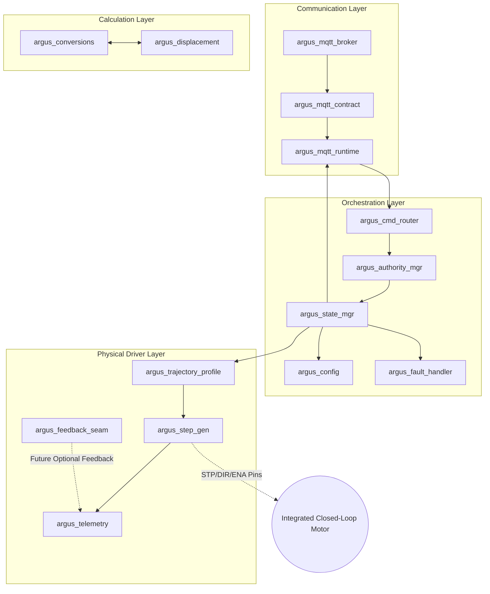

# V2 Pump Controller Architecture Specification

This document defines the module boundaries, state machine behavior, hardware integrations, pulse scheduling, and telemetry contracts for the V2 Pump Controller firmware.

## 1. Recommended V2 Module Boundaries

To isolate hardware mechanics from supervisory business logic and state machine orchestration, the code is divided into the following modules:

### Module Specifications

1.  **Product / Hardware Configuration (`argus_config`)**:
    *   Manages board pin maps, steps/rev, microsteps, gear ratios, acceleration defaults, and network settings.
    *   Saves and loads settings from NVS (Non-Volatile Storage) to support commissioning calibration.
    *   *GPIO5/ENA Polarity*: Physically verified as **active-low**. Preloads output latch to `HIGH` before output pin configuration to prevent startup glitches.
        *   `enable_active_low = true` (LOW maps to Enabled/holding torque, HIGH maps to Disabled/unlocked).
    *   *GPIO3/STEP and GPIO4/DIR Polarity*: Configured for common-anode optocouplers:
        *   `step_active_low = true` (Logical assertion occurs on GPIO falling edge HIGH-to-LOW, deassertion returns STEP HIGH. Baseline/idle state is HIGH).
        *   `dir_inverted = true` (Direction polarity reversed due to common-anode wiring).
2.  **Fixed-Point Units and Conversions (`argus_conversions`)**:
    *   All calculations use fixed-point integer math to avoid float rounding drift.
    *   Speed values are stored in **milli-RPM** ($1 \text{ RPM} = 1000$ units).
        *   `1200` milli-RPM = $1.2 \text{ RPM}$
        *   `12000` milli-RPM = $12.0 \text{ RPM}$
    *   *Unconfirmed Displacement*: Volumetric displacement (default: `0.04 gal/rev`) is treated as unresolved until physical calibration and marked as unconfirmed commissioning configuration.
3.  **Command Ownership and Requested Setpoint (`argus_state_mgr`)**:
    *   Represents the primary machine state controller and arbiter of state truth.
    *   Processes supervisory requests from the HMI or remote clients.
4.  **Displacement and Flow Conversion (`argus_displacement`)**:
    *   Converts volumetric flow requests to target output-shaft speed (milli-RPM) based on commissioned displacement factors.
5.  **Motion Trajectory Profile Generator (`argus_trajectory_profile`)**:
    *   Shapes target speed commands into a continuous ramp profile to prevent stepper stalling.
6.  **STEP Pulse Generator (`argus_step_gen`)**:
    *   Generates high-precision stepping pulses and direction outputs using a mathematically exact Bresenham quotient/remainder timing engine.
    *   *Timing inputs*:
        *   `step_rate_numerator = output_rpm_milli * output_steps_per_revolution`
        *   `step_rate_denominator = 60,000`
        *   `period_ticks = (10,000,000 * step_rate_denominator) / step_rate_numerator`
    *   *Integer & Remainder Scheduling*:
        *   `integer = 600,000,000,000 / (rpm_milli * steps_per_rev)`
        *   `remainder = 600,000,000,000 % (rpm_milli * steps_per_rev)`
    *   *Active-Low STEP Waveform*: Baseline/idle state is `HIGH` (optocoupler off). Assertion drives STEP `LOW` (optocoupler on) for 15 microseconds (150 ticks at 10 MHz), deassertion returns pin `HIGH`.
    *   *Enable-Before-Motion ordering*: Drives GPIO 5 LOW, waits 20 ms for driver settle, and only then starts active-low STEP generation.
    *   *Stop / Unlock behaviors*:
        *   Normal Stop: stops STEP pulses, forces STEP to inactive `HIGH`, leaves ENA LOW (retaining holding torque).
        *   Unlock: stops STEP pulses, forces STEP to inactive `HIGH`, drives ENA HIGH (releasing shaft).
7.  **Telemetry & Feedback Seam (`argus_feedback_seam`)**:
    *   *Direct feedback is unavailable*: A/B encoder quadrature inputs are not exposed to the ESP32-S3. Generated pulses and generated RPM are not proof of physical motor movement.
    *   *No Fake Feedback*: The feedback interface is disabled by default and does not fabricate fake feedback values.
    *   *Telemetry Terms*:
        *   `requested_rpm_milli`: Supervisory target speed in milli-RPM.
        *   `generated_rpm_milli`: STEP pulse rate expressed as equivalent output speed in milli-RPM (exact rational representation is preserved).
        *   `generated_step_count`: Signed, direction-aware count of generated STEP pulses, incrementing strictly on the logical assertion edge (HIGH-to-LOW transition).
        *   `actual_rpm`: Unavailable unless a real feedback provider is connected.
8.  **Fault Detection & Latching (`argus_fault_handler`)**:
    *   Rely on the motor's internal GUI-configured "Max Missing Steps" threshold to lock the driver during a mechanical stall. The controller cannot programmatically detect mechanical stall, encoder loss, following error, or insufficient measured motion without a physical feedback source.
9.  **MQTT Supervisory Contract (`argus_mqtt_broker`, `argus_mqtt_contract`, `argus_mqtt_runtime`)**:
    *   Constructs `argus/<client_id>/<unit_id>` once per valid broker lifecycle and fails closed on unsafe identity components or topic overflow.
    *   Enforces exact publication ownership before retention, subscriber delivery, parsing, or dispatch.
    *   Binds the supervisory lease to a non-reusable broker connection identity and a fresh random broker-lifecycle session.
    *   Requires strict QoS 1, non-retained command envelopes with current session, newer nonzero sequence, bounded command ID, and topic-specific value.
    *   Serializes accepted MQTT work through a bounded worker queue. The only normal motion path is broker to contract/runtime to command router to authority and state management.
    *   Publishes 25 authoritative retained metadata, state, status, and open-loop telemetry topics plus bounded non-retained command results.
10. **Security Contract (Phase 4D.1; implementation deferred)**:
    *   Separates AP join secrets, Argus console verifiers, human accounts, browser sessions, machine credentials, MQTT connection identity, and Phase 4C freshness/session state.
    *   Defines deny-by-default roles, permission ceilings, delegation, and operation-boundary authorization without making login equivalent to operating authority.
    *   Restricts human browser traffic to the protected local AP for this plain-HTTP release and defines `/login`, `/operate`, and `/commission` as logical interface boundaries.
    *   Preserves the existing authority manager, command router, state manager, and fail-operational behavior as the only control architecture. Security code may not create a second motion path.
    *   Defers credential/session implementation, MQTT machine authentication, protected storage, physical recovery trigger selection, HTTPS/TLS, certificates, and hostile-network operation to separately accepted work.

---

## 2. State Machine

The V2 Controller executes a deterministic state machine:
*   **BOOT/CONFIGURING**: CPU boots, preloads GPIO 5 HIGH, STEP HIGH, configures outputs.
*   **READY/STOPPED**: Motor driver idle, ENA pin remains HIGH (disabled), STEP remains HIGH.
*   **STARTING/ACCELERATING**: ENA is driven LOW, delays 20 ms, and starts active-low pulse generation.
*   **RUNNING**: Shaft speed stabilized at target.
*   **DECELERATING**: Ramping speed down toward zero or a lower target.
*   **HOLDING**: Step generation stopped, STEP remains HIGH, ENA remains LOW (holding torque retained).
*   **UNLOCKED**: Step generation stopped, STEP remains HIGH, ENA is driven HIGH (freewheel).
*   **EMERGENCY_STOPPED**: Pulse generation immediately killed, STEP forced HIGH, target reset to zero, ENA remains LOW (locked).
*   **FAULTED**: Latch state. Motion is inhibited. STEP remains HIGH.

---

## 3. Pulse-Generator Spike

### GPTimer Candidate
*   **Pulse Engine Selection**: `GPTimer` is the leading candidate pending measured validation (not an irrevocable selection).
*   **Fractional Scheduling**: Generates exact step frequencies (like $66\frac{2}{3} \text{ Hz}$ at $0.5 \text{ RPM}$) using a Bresenham quotient/remainder accumulator inside a timer interrupt to toggle a GPIO.
*   **Waveform Validation**: Must account for rising/falling edges, pulse widths, worst-case interrupt rates (26.667 kHz at 200 RPM), and ISR execution timing margin under concurrent networking load.
*   **State Acceptance**: The timing configuration is only updated in telemetry once the hardware backend has successfully accepted the requested configuration.
*   **ISR Memory & Dereference Safety**: To guarantee cache-safety, the active config parameters (STEP, DIR, ENA pins, polarities) are copied into local static DRAM variables during module initialization. The ISR does not dereference `s_cfg` or read flash/PSRAM memory.
*   **Synchronization & Locking**: Synchronization uses `taskENTER_CRITICAL_ISR(&s_timing_mux)` which is a portMUX spinlock. Task-side critical sections are kept extremely short (limited to simple variable copies) to avoid lock contention.
*   **Measurements**: Latency, jitter, interrupt contention, and actual execution duration are marked as **pending hardware measurement**.

---

## 4. Safety and Fail-Operational Behavior

### Emergency Stop Distinction
*   **Software/MQTT E-Stop**: The MQTT E-Stop command is a software-level emergency shutdown request. MQTT is NOT a safety-rated path.
*   **Physical E-Stop**: An independently wired physical safety circuit must be used for hardware-level emergency stop. The controller does not trigger unverified physical E-stop pins.

### Fail-Operational Policy (Supervisory Communication Loss)
*   **Lost Connection**: If the MQTT connection drops or the heartbeat expires during a run, the controller continues at the last accepted trajectory rate. Link state becomes `STALE` or `OFFLINE`; no automatic Stop, target clear, driver disable, or synthetic state transition occurs.
*   **State Recovery**: The controller cannot queue commands it never received. Once a client reconnects, the current retained baseline is republished before new command decisions.
*   **Session and Freshness**: Every broker lifecycle creates a new command session. A two-second heartbeat and six-second lease timeout bind one current connection. Strict uint32 sequence ordering, exact-duplicate result replay, stale rejection, and sequence-conflict rejection prevent delayed or altered commands from dispatching.
*   **Authority Boundary**: Heartbeat presence does not grant browser or CLI authority. The server captures MQTT source and authority generation, and the existing router rechecks authority before state mutation.
