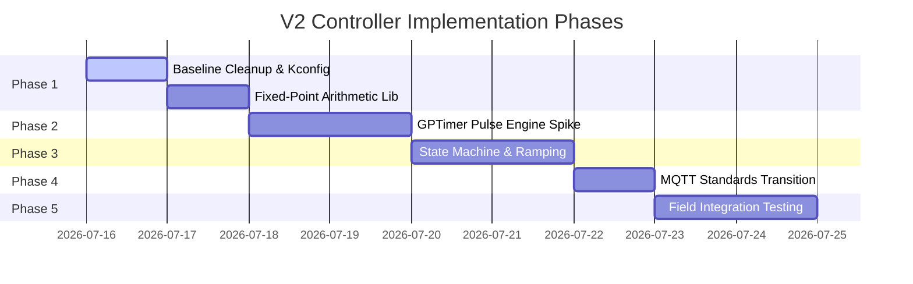

# V2 Pump Controller Implementation Plan

This document maps out the staged implementation plan, hardware checkpoints, and unresolved design decisions for the V2 Pump Controller redesign.

## 1. Staged Implementation Order

### Phase Details

#### Phase 1: Foundation, Deprecation, and Calculations
*   **Tasks**:
    *   Delete the unused CAN files (`main/argus_can.c`, `main/argus_can.h`, `main/argus_protocol.h`) as a scope cleanup (the platform retains hardware CAN capability, but it is outside the active V2 scope).
    *   Clean up `main/CMakeLists.txt` to remove references to CAN and legacy stepper files.
    *   Build the fixed-point math conversion library for converting Flow (mL/min) to target RPM (milli-RPM) and STEP frequency (milli-Hz).
        *   `1200` milli-RPM = $1.2 \text{ RPM}$
        *   `12000` milli-RPM = $12.0 \text{ RPM}$
    *   Establish Kconfig variables for configurations, using blank or placeholder strings for credentials (production credentials belong to NVS/provisioning).

#### Phase 2: GPTimer Pulse Engine Technology Spike
*   **Tasks**:
    *   Implement the low-level `argus_step_gen` driver interface using the `GPTimer` candidate (pending measured validation).
    *   Build a Bresenham-based quotient/remainder scheduling routine in the ISR.
    *   Verify pulse generation accuracy down to $0.5 \text{ RPM}$ ($66\frac{2}{3} \text{ Hz}$) and increments of $0.1 \text{ RPM}$ ($13\frac{1}{3} \text{ Hz}$) using an oscilloscope.
    *   *Serialization*: Serialize all task-context GPTimer start/stop/arm calls using a single FreeRTOS mutex `s_lifecycle_mutex`.
    *   *Double-Guard Stop*: Check `s_running` flag before setting STEP high inside the ISR, halting step pulse generation immediately.
    *   *Memory Safety*: Copy all configuration items to static DRAM variables during init, completely avoiding dereferencing config pointers (`s_cfg`) inside the ISR.
    *   *Active-Low ENA Integration*: Configure GPIO 5 as active-low ENABLE output. Preload ENA to HIGH on boot. Implement explicit enable/disable driver APIs, wait 20 ms before starting motion, and preserve holding torque during normal stops.
    *   *Common-Anode STEP/DIR Correction*: Configure active-low STEP and inverted DIR wiring:
        *   STEP initializes and remains inactive-high (`HIGH`).
        *   Logical STEP assertion drives STEP pin `LOW` for 6 us (60 ticks at 10 MHz), deassertion returns it to `HIGH`.
        *   DIR setup and hold timing measured relative to the logical assertion edge (HIGH-to-LOW transition).

#### Phase 3: State Machine & Trajectory Shaping
*   **Tasks**:
    *   Write the state machine engine based on the state architecture defined in `V2_CONTROLLER_ARCHITECTURE.md`.
    *   Implement the trajectory shaping profile task (linear acceleration/deceleration ramping) to process target speed adjustments.
    *   Set the status output values and step position calculations based directly on the generated step count telemetry (`generated_step_count` and `generated_rpm_milli`).

#### Phase 4: Dynamic MQTT & Fail-Operational Configuration
*   **Tasks**:
    *   Modify `app_main.c` and `argus_mqtt_broker.c` to parse and publish to dynamic topic trees incorporating client name and unit ID.
    *   Implement the Fail-Operational supervisor: monitor connection state and heartbeats. If connection drops, continue pumping at the last valid trajectory rate. Republication occurs upon reconnection.
    *   Document freshness, sequence, and idempotency behavior to prevent replaying stale commands (START, STOP, setpoints) blindly after recovery.

#### Phase 5: Field Integration and Calibration
*   **Tasks**:
    *   Tune trajectory ramp acceleration.
    *   Verify displacement scaling through physical validation.
    *   Finalize and clear retained discovery configuration topics.

---

## 2. Hardware Validation Checkpoints

To guarantee safety boundaries and maintain hardware health, the implementation stops for manual validation at the following check gates:

### Checkpoint A: Pulse Engine Accuracy (Inhibited Motor)
*   **Verification Method**: Attach an oscilloscope or logic analyzer to the STEP (GPIO 3) pin. Do not energize GPIO 5 (ENABLE/shutdown).
*   **Test Cases**:
    *   Command target of $0.5 \text{ RPM}$. Confirm output frequency is stable at $66.67 \text{ Hz} \pm 0.1 \text{ Hz}$ and pulse width is $> 3\text{ us}$.
    *   Command speed adjustments in $0.1 \text{ RPM}$ steps. Confirm frequency changes step cleanly without jitter or discontinuities.
    *   Verify generated pulses are not treated as proof of physical movement in telemetry.

### Checkpoint B: Enable Polarity Verification
*   **Verification Method**: Measure the voltage on GPIO 5 (ENABLE/shutdown) while requesting changes.
*   **Test Cases**:
    *   **RESOLVED**: Wiring and active-low polarity physically verified on production hardware.
    *   LOW = Enabled/Holding, HIGH = Disabled/Unlocked.

### Checkpoint C: STEP & DIR Polarity Verification
*   **Verification Method**: Measure STEP (GPIO3) and DIR (GPIO4) output level at oscilloscope.
*   **Test Cases**:
    *   **RESOLVED**: Wiring and active-low STEP and inverted DIR physically verified on production hardware.
    *   Idle level: approximately 3.3 V (HIGH).
    *   Active pulse: approximately 0 V (LOW).
    *   Active pulse width: 6 microseconds.

### Checkpoint D: E-Stop & Lock Verification
*   **Verification Method**: Publish E-STOP request or trigger physical safety pins.
*   **Test Cases**:
    *   Distinguish a software/MQTT emergency-stop request from an independently wired physical safety circuit. Verify step pulses terminate instantly ($< 1\text{ ms}$) on software E-stop.
    *   Confirm MQTT is not described as a safety-rated E-stop path.

---

## 3. Resolved Parameters

1.  **Volumetric Flow / Scaling Constants**:
    *   *Unconfirmed Displacement*: Volumetric displacement (configured default: $0.04 \text{ gallons/rev}$, approximately $151,416 \text{ microliters/rev}$) is treated as unconfirmed commissioning configuration.
